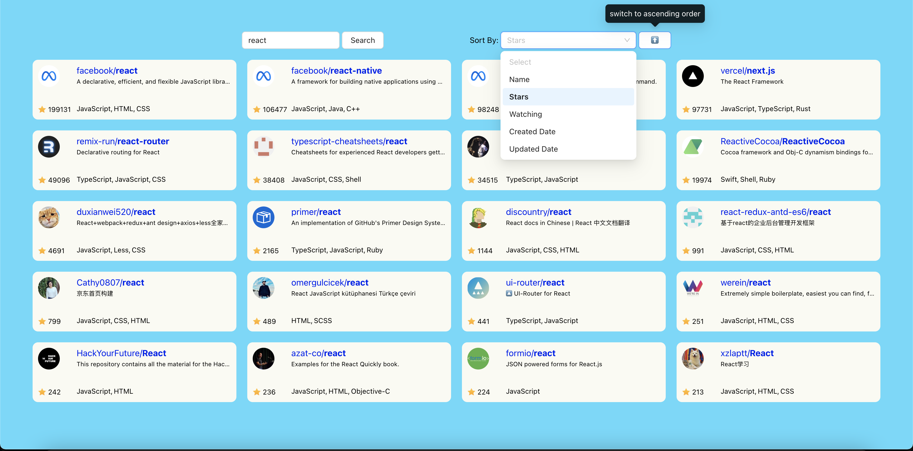

1. run `nvm use 14` in the terminal.
2. Add a file with name `.env` to root folder. Inside add REACT_APP_API_ACCESS=__\<GIT API access token\>__. Replace "\<GIT API access token\>" with git api access token generated from your account. To create the token follow this [doc](https://docs.github.com/en/enterprise-server@3.4/authentication/keeping-your-account-and-data-secure/creating-a-personal-access-token#creating-a-personal-access-token).
3. run `npm i`.
4. run `npm start`.

